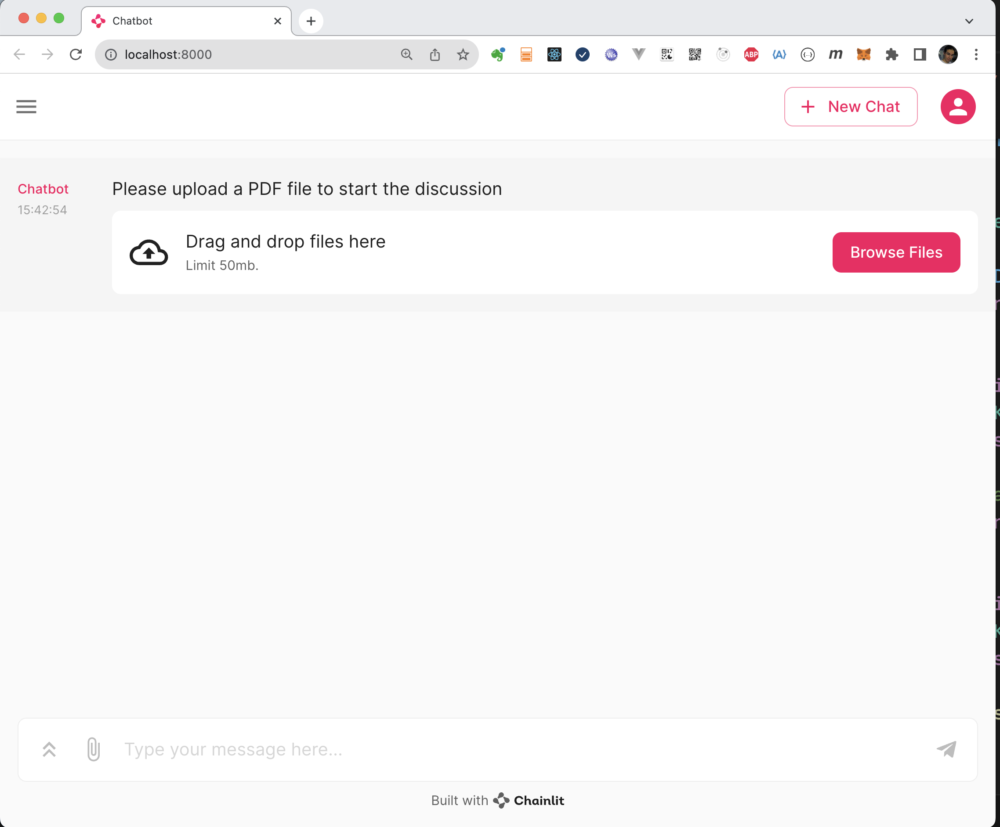
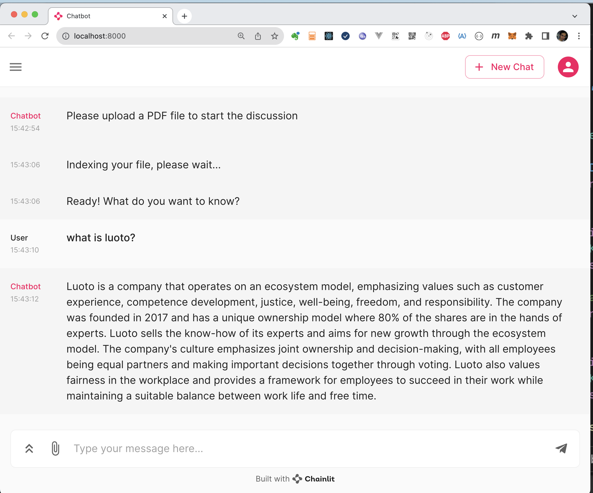

# Part 2: Adding a user interface

Now we'll add a user interface using [Chainlit](https://docs.chainlit.io/get-started/overview).

There is a full example available in `ui_example.py`. It can be run with:

```
export OPENAI_API_KEY=<your key>
chainlit run ui_example.py
```

In `http://localhost:8000`, you should see a following kind of UI:




## To the code

First, the imports:

```python
import chainlit as cl
import os
import tempfile

# Helper functions in utils.py from cmdline example
from utils import build_index, build_messages

import openai

# https://github.com/huggingface/transformers/issues/5486
os.environ["TOKENIZERS_PARALLELISM"] = "false"
```

Then a simple helper for sending a message to the user:

```python
async def send_msg(message: str):
    await cl.Message(
        content=message,
    ).send()
```

### Chat start event

When the user opens the chat window, the chainlit callback `@cl.on_chat_start` is called. When the chat starts, we want to ask the user to upload a file, which is then indexed using the functions from the command-line example and stored to the session.

```python
@cl.on_chat_start
async def start():
    files = None

    while files is None:
        files = await cl.AskFileMessage(
            content="Please upload a PDF file to start the discussion",
            accept=['application/pdf'],
            max_size_mb=50
        ).send()

    await send_msg('Indexing your file, please wait...')
    new_file, tmp_filename = tempfile.mkstemp()
    try:
        with open(files[0].path, "rb") as f:
            binary_content = f.read()
        os.write(new_file, binary_content)
        os.close(new_file)
    except Exception as e:
        await send_msg(f"Error processing file: {str(e)}")
        return

    collection = build_index(tmp_filename, files[0].name)

    # Store the collection so it can be retrieved in the message callback
    cl.user_session.set("collection", collection)

    await send_msg('Ready! What do you want to know?')
```

### Chat message event

When the user sends a message, it triggers the `@cl.on_message` callback. In that, we want to run the same logic as with the command line app:

- do a search to the vector database with the user's question
- form a context + system prompt
- make a call to OpenAI
- stream the answer to the user, token by token

```python
@cl.on_message
async def on_message(message: cl.Message):
    user_question = message.content
    collection = cl.user_session.get("collection")

    # Seach entries from the vector database
    search_result = collection.query(
        query_texts=[user_question],
        n_results=10
    )
    context = [''.join(doclist) for doclist in search_result['documents']]

    stream = openai.chat.completions.create(
        model="gpt-4o",
        messages=build_messages(user_question, context),
        temperature=0.75,
        top_p=0.2,
        max_tokens=512,
        stream=True
    )

    response = cl.Message(content="")

    # Stream the LLM's output to screen, token by token
    for txt in stream:
        content = txt.choices[0].delta.content or ""

        if (content):
            await response.stream_token(content)

    await response.send()
```

Done! Now you should be able to run the UI using a similar command as at the beginning.
